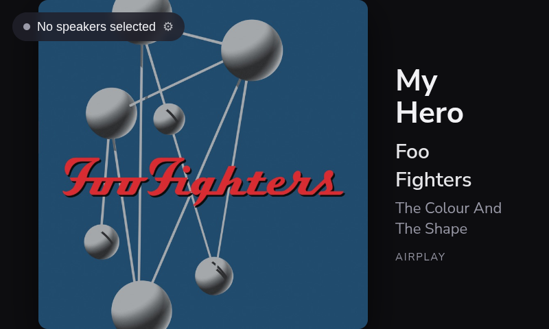

# vinylcast

**Stream a turntable (or any analog line-in source) to your AirPlay speakers — the
DIY replacement for the "AirPlay cast from line-in" feature WiiM/Linkplay removed.**

A Raspberry Pi captures the analog signal from your turntable and re-broadcasts it,
synchronized, to any number of AirPlay / AirPlay-2 receivers (HomePods, AirPlay
speakers, other Pis running shairport-sync). The heavy lifting is done by
[**OwnTone**](https://owntone.github.io/owntone-server/) (formerly forked-daapd),
which is one of the very few pieces of software that can act as an AirPlay
**sender** to multiple speakers at once.

> **Why this exists.** AirPlay is a one-way protocol with two roles: *receivers*
> (speakers — everywhere, cheap) and *senders* (normally your phone/Mac). A hardware
> box that takes an **analog input** and acts as the **sender** is rare, because
> there's no licensed path to build one — everyone doing it is riding a
> reverse-engineered RAOP implementation. That's exactly why it's the first feature
> vendors quietly drop in a firmware update (WiiM did; Bluesound/Arylic restrict it
> to their own ecosystems). A Pi you control doesn't get that feature taken away.

---

## What it looks like

The optional 7″ touchscreen turns the Pi into a self-contained appliance: big album
art, now-playing metadata, a source badge, and a speaker picker — no phone or laptop
needed to see what's on.



*Now-playing on the 7″ panel. Metadata comes straight from the AirPlay source
(shairport-sync), with an iTunes-art fallback; for vinyl the same slot will be filled
by audio fingerprinting (ACR). When nothing's playing the panel shows a quiet
"Listening…" state and sleeps until audio resumes or you tap it.*

---

## Status (2026-09)

**Working end-to-end for AirPlay-in; vinyl path designed, awaiting the USB ADC.**

- ✅ **OwnTone** (built from source) on a Pi 5 → drives all your AirPlay 1 + 2 speakers
- ✅ **shairport-sync** so you can AirPlay *to* the Pi ("Vinylcast") → out to any/all speakers
- ✅ **Custom 7″ touchscreen kiosk** — live album art + artist/track/album, speaker
  picker, vinyl-only flip timer, reliable art (source or iTunes fallback)
- ✅ **Appliance behavior** — boots straight into the kiosk (systemd + labwc autostart);
  the panel sleeps when nothing's playing and wakes on audio or a tap
- ⏳ **Vinyl** (turntable → USB line-in) — same pipeline, ADC (Behringer UCA202) not yet attached

> **Working on this repo?** The forward plan is in [`docs/ROADMAP.md`](docs/ROADMAP.md);
> the kiosk's own [`display/README.md`](display/README.md) covers running and deploying it.

---

## How it works

```
 ┌───────────┐   phono/line   ┌──────────────┐  USB   ┌──────────────────────────┐
 │ Turntable │ ─────────────▶ │ Phono preamp │ ─────▶ │ Raspberry Pi             │
 │ (cartridge)│   (if needed) │  + USB ADC   │  PCM   │                          │
 └───────────┘                └──────────────┘        │  arecord ──▶ named pipe  │
                                                       │                 │        │
                                                       │            OwnTone reads │
                                                       │                 │        │
                                                       └─────────────────┼────────┘
                                                                         │ AirPlay 2 (Wi-Fi)
                                              ┌──────────────────────────┼───────────────┐
                                              ▼              ▼            ▼               ▼
                                          HomePod     AirPlay spkr   Pi + shairport   Kitchen…
                                          (all in sync, you pick which zones play)
```

1. `arecord` (ALSA) captures the USB sound card's line-in as PCM16 stereo and writes
   it to a **named pipe** inside OwnTone's library folder.
2. OwnTone detects the pipe, reads the audio, and streams it out to whichever
   AirPlay speakers ("outputs") you've selected — in sync, multiroom.
3. You control which zones are playing from OwnTone's web UI (`http://<pi>:3689`)
   or any Apple "Remote"-compatible app.

## Quick links

- **[docs/HARDWARE.md](docs/HARDWARE.md)** — exact parts to buy (with the one board
  that makes this a 2-cable job for a bare turntable).
- **[docs/SETUP.md](docs/SETUP.md)** — full step-by-step: OS, OwnTone, capture
  service, selecting speakers, troubleshooting.
- **[docs/SNAPCAST-ALTERNATIVE.md](docs/SNAPCAST-ALTERNATIVE.md)** — if your speakers
  don't *have* to be AirPlay, Snapcast is lower-latency and rock-solid.
- **[docs/SCREEN-UI.md](docs/SCREEN-UI.md)** — *(phase 2)* touchscreen kiosk: pick
  which AirPlay zones to stream to, then show album art + now-playing.
- **[docs/NOW-PLAYING-ACR.md](docs/NOW-PLAYING-ACR.md)** — *(phase 2)* how to
  identify a vinyl track with no metadata (audio fingerprinting: AudD/ACRCloud).

## The one thing to set your expectations on: latency

AirPlay buffers ~1–2 seconds. **This is built for whole-home listening, not
lip-sync.** You'll drop the needle and hear it around the house a second or two
later, all zones in sync with each other. That's perfect for "play my record
everywhere" and wrong for "watch the platter and hear it instantly." If you need
low latency, use the [Snapcast path](docs/SNAPCAST-ALTERNATIVE.md) (~tens of ms)
instead — at the cost of the endpoints being Snapclients rather than AirPlay.

## Fast path (TL;DR)

```sh
# On the Pi (Raspberry Pi OS Lite, 64-bit):
sudo apt update && sudo apt install -y owntone alsa-utils
arecord -l                                  # find your USB card number (e.g. card 1)

# Clone this repo and install the capture service + config:
git clone https://github.com/<you>/vinylcast && cd vinylcast
sudo cp config/owntone.conf.snippet /etc/owntone.conf.d/vinylcast.conf   # or merge into /etc/owntone.conf
sudo install -m0755 scripts/linein-capture.sh /usr/local/bin/vinylcast-capture
sudo install -m0644 systemd/vinylcast-capture.service /etc/systemd/system/

# Point the service at your card, create the pipe dir, start everything:
sudo mkdir -p /srv/vinylcast && sudo chown owntone:owntone /srv/vinylcast
sudoedit /etc/systemd/system/vinylcast-capture.service   # set CARD=hw:1,0 to match arecord -l
sudo systemctl enable --now owntone vinylcast-capture

# Open http://<pi>:3689 → select your AirPlay speakers as outputs → play "vinyl".
```

See **[docs/SETUP.md](docs/SETUP.md)** for what each step means and how to verify it.

## Roadmap

- **Phase 1 — audio (this repo's core).** Turntable → Pi → AirPlay speakers,
  multiroom, via OwnTone. See [SETUP.md](docs/SETUP.md).
- **Phase 2 — touchscreen.** A Pi with a display becomes an appliance:
  - **2a** kiosk + WebSocket pipeline (shows OwnTone metadata end to end),
  - **2b** speaker **picker** over OwnTone's `/api/outputs`, collapse-to-chip,
  - **2c** **now-playing** — fingerprint the vinyl audio (ACR) and show album art,
  - **2d** polish (art crossfade, listening/fallback states, per-zone volume).

  See [SCREEN-UI.md](docs/SCREEN-UI.md) and [NOW-PLAYING-ACR.md](docs/NOW-PLAYING-ACR.md).
  The one non-obvious bit: **vinyl has no metadata**, so "what's playing" requires
  audio fingerprinting against a catalog (like Shazam does) — not a metadata read.

## Status

Documentation + config scaffolding. The pieces (OwnTone pipe input, ALSA capture)
are individually well-proven; the exact config values here are sane defaults you
should sanity-check against the [OwnTone docs](https://owntone.github.io/owntone-server/)
for your version. PRs welcome.

## License

MIT — see [LICENSE](LICENSE).
